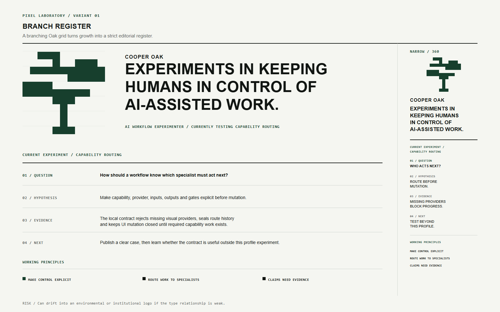
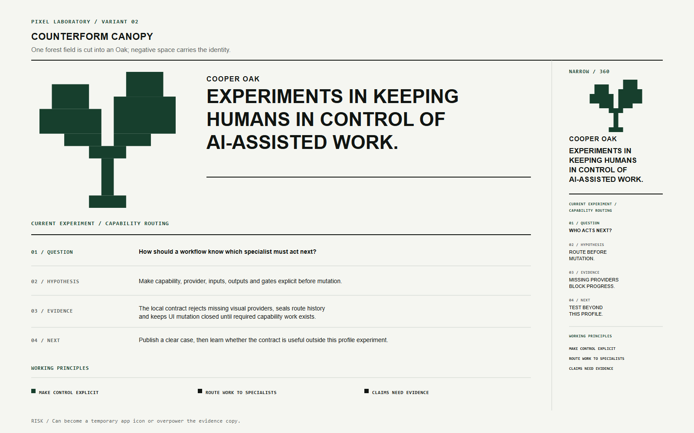
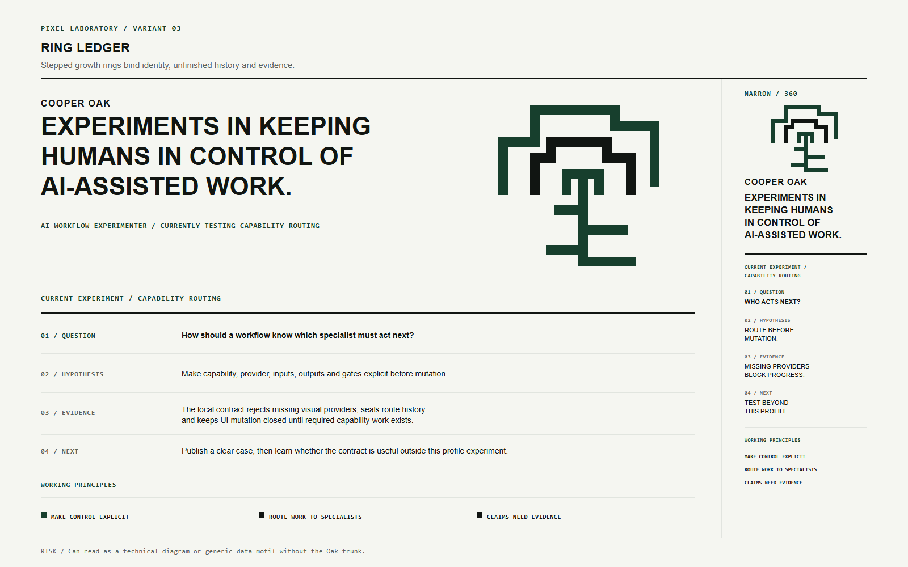

# Pixel Laboratory — internal concept round

Status: `03 — Ring Ledger` selected by the user; the other two boards remain
preserved alternatives.
Authority: [`decision-contract.md`](../../decision-contract.md) and
[`selected-art-direction.md`](../../selected-art-direction.md).
Active route: `revision-003` (`26c3b6bec50588928c00bee0c3470e393446e1be5b08641a28a9549ad7a87d51`).
Review: [`independent-review.md`](independent-review.md).

## Shared comparison contract

All three boards use the same content, palette family, dimensions, type
fallbacks, and output pipeline. They vary only the Oak glyph, Hero composition,
responsive reduction, and experiment-record rhythm.

Each board contains:

- one abstract Oak glyph;
- the approved Hero line;
- a real Capability Routing sample using
  `QUESTION → HYPOTHESIS → EVIDENCE → NEXT`;
- the three approved working principles;
- a narrow-layout study;
- no cards, fake controls, telemetry, gradients, shadows, animation, remote
  assets, pixel body font, HUD, terminal chrome, or decorative AI imagery.

## 01 — Branch Register

The Oak expands through a disciplined branch grid. It is the calmest and most
editorial of the three, with the clearest reading order.

Primary review question: does it remain unmistakably Cooper, or does it become
an institutional/environmental mark?

## 02 — Counterform Canopy

A single forest field carries the strongest counterform and the greatest visual
authority. Text has to hold its own against the block.

Primary review question: is the negative-space Oak authored and memorable, or
does it collapse into an app-icon rectangle?

## 03 — Ring Ledger

Stepped rings connect Oak growth, the honest learning trail, and evidence that
accumulates without rewriting history.

Primary review question: does the ring logic still read as Oak and identity, or
does it become a generic technical diagram?

## Selection rule

Do not average the three boards. Select one dominant system after independent
review. A later decision may borrow one explicitly named secondary property,
but cannot merge every motif into a decorative kit.

## Independent review outcome

- `01 — Branch Register`: selectable after its detached canopy fragment was
  repaired and independently rechecked.
- `02 — Counterform Canopy`: selectable; its app-tile and duplicate control
  module readings were removed.
- `03 — Ring Ledger`: selectable and independently recommended because its open
  canopy rings make the Oak-growth/evidence relationship the most authored and
  least transferable of the three.

The user selected `03 — Ring Ledger` after reviewing all three cleared boards.
Canonical product `visual_design`, `craft`, `design_review`, implementation
projection, and UI mutation remain unresolved.

## Files and provenance

- `concept-boards.json` is the shared input contract.
- `render-concept-boards.mjs` generates the three SVG sources, PNG review
  snapshots, and `render-manifest.json` with SHA-256 provenance.
- `render-concept-boards.test.mjs` verifies the constrained SVG/PNG surface and
  source-avatar traceability.
- `independent-review.md` preserves the initial blockers and both append-only
  verification passes.
- `boards/*.svg` are vector review sources.
- `previews/*.png` are renderer-specific review snapshots, not Profile assets.
