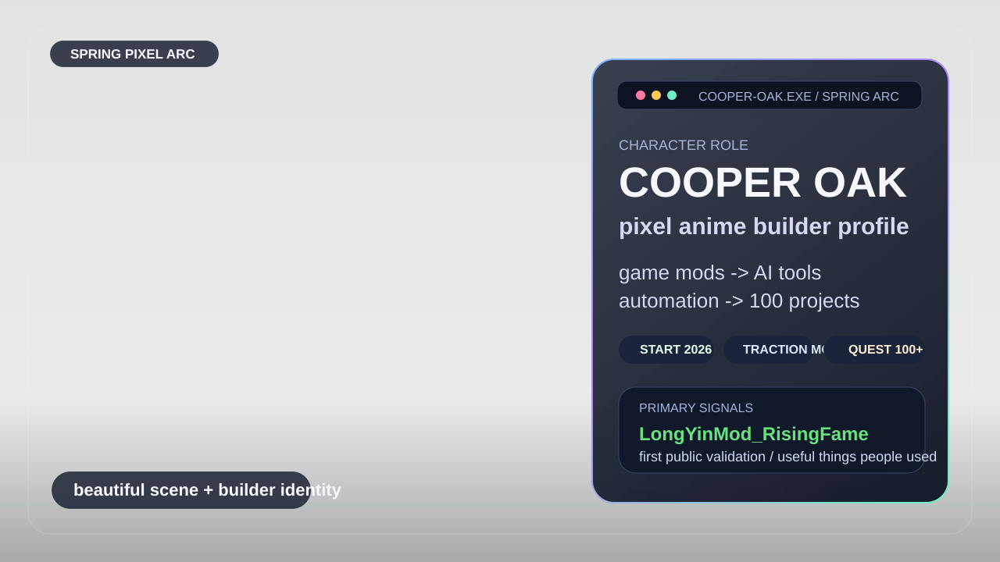
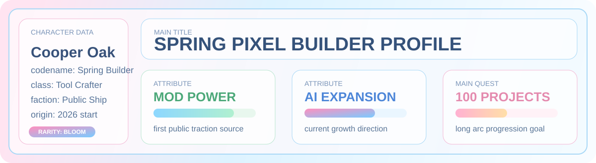
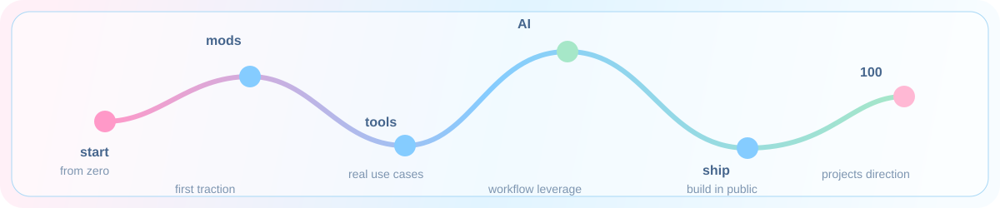
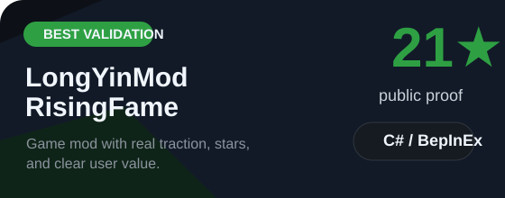
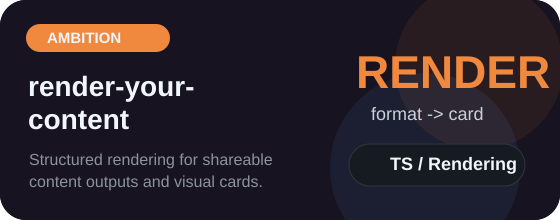
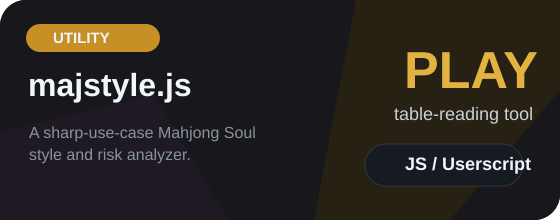

  

   
   

  

  
  
  

  <a href="https://github.com/Cooper-X-Oak?tab=repositories">archive</a> •
  <a href="https://github.com/Cooper-X-Oak?tab=stars">star log</a> •
  <a href="https://github.com/Cooper-X-Oak/LongYinMod_RisingFame">skill card</a> •
  <a href="https://github.com/Cooper-X-Oak/OpenType">equipment</a>

## Character Sheet

  

## World Map

  

## Skill Deck

## Battle Stats

## Loadout

  
  
  
  

## Fast Travel

| Best Validation | Cleanest Product | Most Ambitious | Fun Utility |
| --- | --- | --- | --- |
| [LongYinMod_RisingFame](https://github.com/Cooper-X-Oak/LongYinMod_RisingFame) | [OpenType](https://github.com/Cooper-X-Oak/OpenType) | [render-your-content](https://github.com/Cooper-X-Oak/render-your-content) | [majstyle.js](https://github.com/Cooper-X-Oak/majstyle.js) |

## Field Activity

## Status HUD

  

