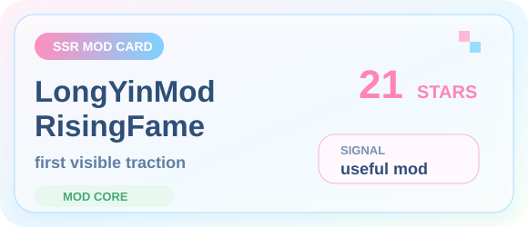
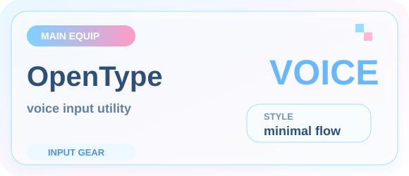
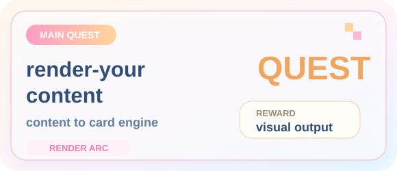
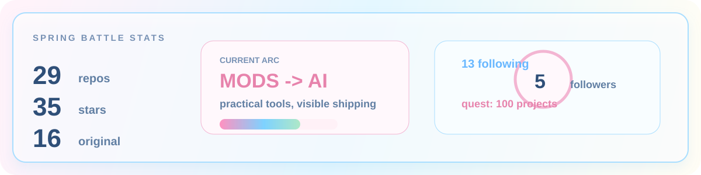
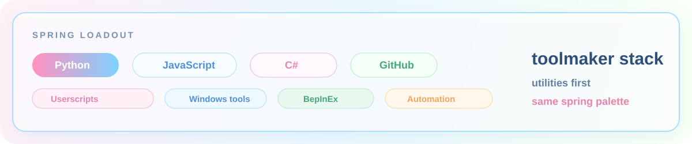
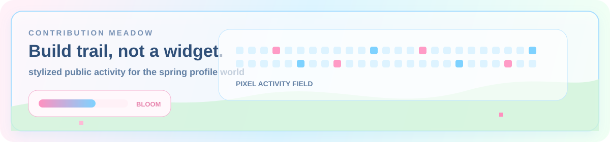
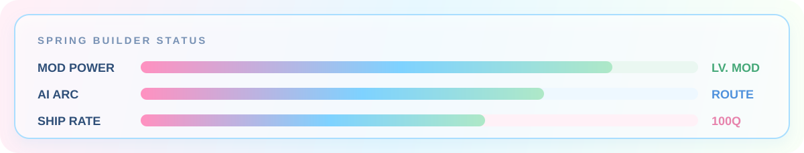

  

   
   

  

  

    <a href="https://github.com/Cooper-X-Oak?tab=repositories">archive</a> &nbsp;|&nbsp;
    <a href="https://github.com/Cooper-X-Oak?tab=stars">star log</a> &nbsp;|&nbsp;
    <a href="https://github.com/Cooper-X-Oak/LongYinMod_RisingFame">skill card</a> &nbsp;|&nbsp;
    <a href="https://github.com/Cooper-X-Oak/OpenType">equipment</a>
  

  
  

 

  
  

 

  

  
  

  
  

 

  
  

 

  
  

 

  
  

 

  
  

 

  
  

