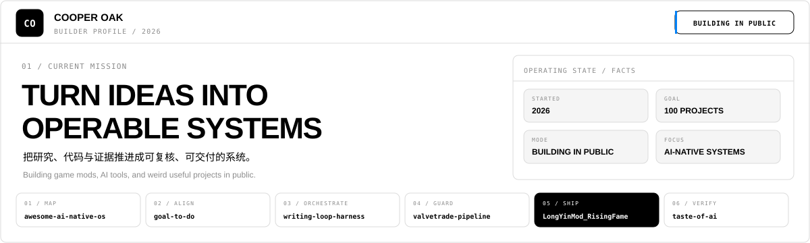
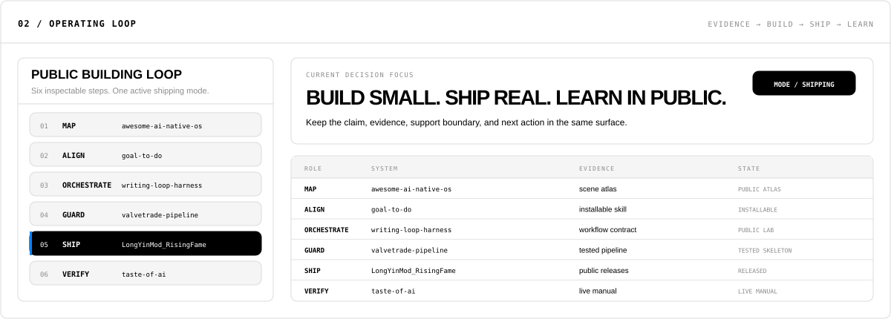

<picture>
  <source media="(prefers-color-scheme: dark) and (max-width: 600px)" srcset="assets/profile-hero-mobile-dark.svg">
  <source media="(prefers-color-scheme: light) and (max-width: 600px)" srcset="assets/profile-hero-mobile-light.svg">
  <source media="(prefers-color-scheme: dark)" srcset="assets/profile-hero-dark.svg">
  <source media="(prefers-color-scheme: light)" srcset="assets/profile-hero-light.svg">
  
</picture>

<a href="https://github.com/Cooper-X-Oak?tab=repositories">REPOSITORIES</a> · <a href="https://github.com/Cooper-X-Oak/LongYinMod_RisingFame/releases">LATEST RELEASES</a> · <a href="https://github.com/Cooper-X-Oak/awesome-ai-native-os">AI-NATIVE ATLAS</a>

Building game mods, AI tools, and weird useful projects in public.

> 把研究、代码与证据推进成可复核、可交付的系统。

## Selected systems

### MAP / [awesome-ai-native-os](https://github.com/Cooper-X-Oak/awesome-ai-native-os)

An atlas of AI-native production systems, organized by business scene, persistent object, and operating model.

**Evidence:** [scene atlas](https://github.com/Cooper-X-Oak/awesome-ai-native-os/tree/main/scenes) · **State:** PUBLIC ATLAS

### ALIGN / [goal-to-do](https://github.com/Cooper-X-Oak/goal-to-do)

A Codex skill that turns vague long-running tasks into aligned, paste-ready goal prompts.

**Evidence:** [installable skill](https://github.com/Cooper-X-Oak/goal-to-do/tree/main/skills/goal-todo) · **State:** INSTALLABLE

### ORCHESTRATE / [writing-loop-harness](https://github.com/Cooper-X-Oak/writing-loop-harness)

A file-based agent workflow control plane with inspectable nodes, gates, and a local operator surface.

**Evidence:** [workflow contract](https://github.com/Cooper-X-Oak/writing-loop-harness/blob/main/LOOP.md) · **State:** PUBLIC LAB

### GUARD / [valvetrade-pipeline](https://github.com/Cooper-X-Oak/valvetrade-pipeline)

A TypeScript and PostgreSQL pipeline skeleton with database guards, RLS isolation, deduplication, and real Postgres tests.

**Evidence:** [tested pipeline](https://github.com/Cooper-X-Oak/valvetrade-pipeline) · **State:** TESTED SKELETON

### SHIP / [LongYinMod_RisingFame](https://github.com/Cooper-X-Oak/LongYinMod_RisingFame)

A stable, practical BepInEx mod for LongYinLiZhiZhuan with published releases and documented support boundaries.

**Evidence:** [public releases](https://github.com/Cooper-X-Oak/LongYinMod_RisingFame/releases) · **State:** RELEASED

### VERIFY / [taste-of-ai](https://github.com/Cooper-X-Oak/taste-of-ai)

An evidence-backed field manual that tests AI skills and workflows instead of repeating product claims.

**Evidence:** [live manual](https://cooper-x-oak.github.io/taste-of-ai/) · **State:** LIVE MANUAL

## Operating loop

<picture>
  <source media="(prefers-color-scheme: dark) and (max-width: 600px)" srcset="assets/profile-loop-mobile-dark.svg">
  <source media="(prefers-color-scheme: light) and (max-width: 600px)" srcset="assets/profile-loop-mobile-light.svg">
  <source media="(prefers-color-scheme: dark)" srcset="assets/profile-loop-dark.svg">
  <source media="(prefers-color-scheme: light)" srcset="assets/profile-loop-light.svg">
  
</picture>

**MAP → ALIGN → ORCHESTRATE → GUARD → SHIP → VERIFY**

## Module registry

<strong>AI-NATIVE OPERATIONS</strong> · 5 public modules

- [awesome-ai-native-os](https://github.com/Cooper-X-Oak/awesome-ai-native-os) — AI-native production system atlas.
- [goal-to-do](https://github.com/Cooper-X-Oak/goal-to-do) — Goal-alignment skill for long-running work.
- [writing-loop-harness](https://github.com/Cooper-X-Oak/writing-loop-harness) — File-native workflow control plane.
- [loop-preflight](https://github.com/Cooper-X-Oak/loop-preflight) — Preflight protocol for agent loops.
- [trae-agent-rules](https://github.com/Cooper-X-Oak/trae-agent-rules) — Structured agent rules for AI-assisted coding.

<strong>EVIDENCE &amp; CONTENT</strong> · 3 public modules

- [taste-of-ai](https://github.com/Cooper-X-Oak/taste-of-ai) — Evidence-backed AI capability field manual.
- [Cooper_Factory](https://github.com/Cooper-X-Oak/Cooper_Factory) — Bilibili subtitle and structured video analysis.
- [ai-haitao-guide](https://github.com/Cooper-X-Oak/ai-haitao-guide) — An AI-assisted cross-border shopping guide.

<strong>SYSTEMS SHIPPED</strong> · 2 public modules

- [LongYinMod_RisingFame](https://github.com/Cooper-X-Oak/LongYinMod_RisingFame) — Released BepInEx game mod.
- [valvetrade-pipeline](https://github.com/Cooper-X-Oak/valvetrade-pipeline) — Tested TypeScript and PostgreSQL pipeline skeleton.

## Operating principles

- Evidence before claims.
- Human review at consequential gates.
- Files as durable operating context.
- Ship small, verify, then improve.

<a href="https://github.com/Cooper-X-Oak?tab=repositories">REPOSITORIES</a> · <a href="https://github.com/Cooper-X-Oak/LongYinMod_RisingFame/releases">LATEST RELEASES</a> · <a href="https://github.com/Cooper-X-Oak/awesome-ai-native-os">AI-NATIVE ATLAS</a>

<!-- Generated from profile.evidence-console.json. The visual architecture is inspired by Profile Control Plane; published claims and links are limited to public Cooper-X-Oak repositories. -->
