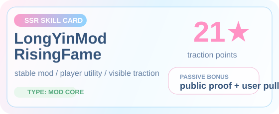
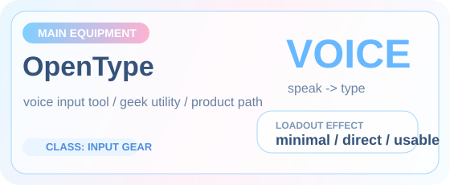
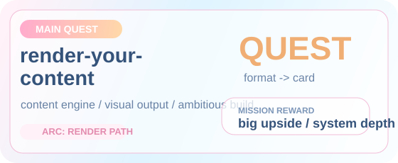
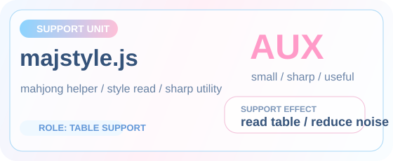
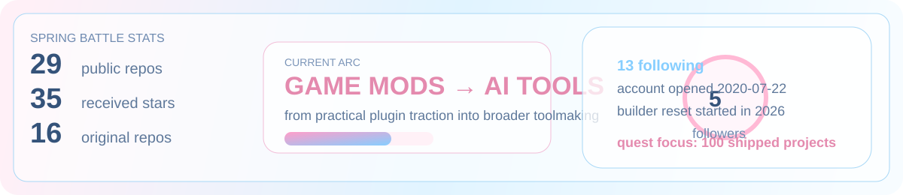
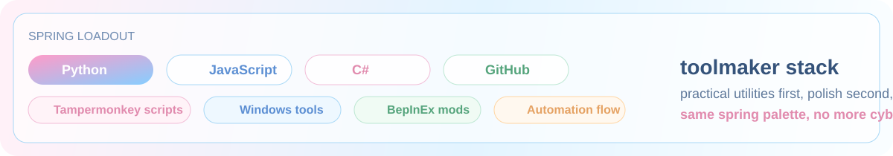
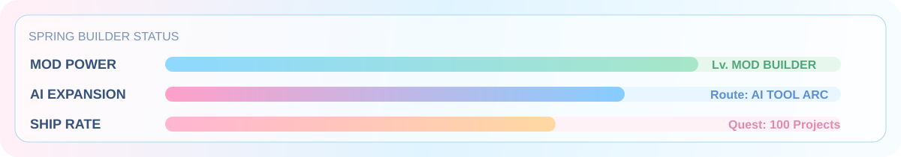

  

   
   

  

  
  
  

  <a href="https://github.com/Cooper-X-Oak?tab=repositories">archive</a> •
  <a href="https://github.com/Cooper-X-Oak?tab=stars">star log</a> •
  <a href="https://github.com/Cooper-X-Oak/LongYinMod_RisingFame">skill card</a> •
  <a href="https://github.com/Cooper-X-Oak/OpenType">equipment</a>

## Character Sheet

  

## World Map

  

## Skill Deck

## Battle Stats

## Loadout

## Fast Travel

## Field Activity

## Status HUD

  

